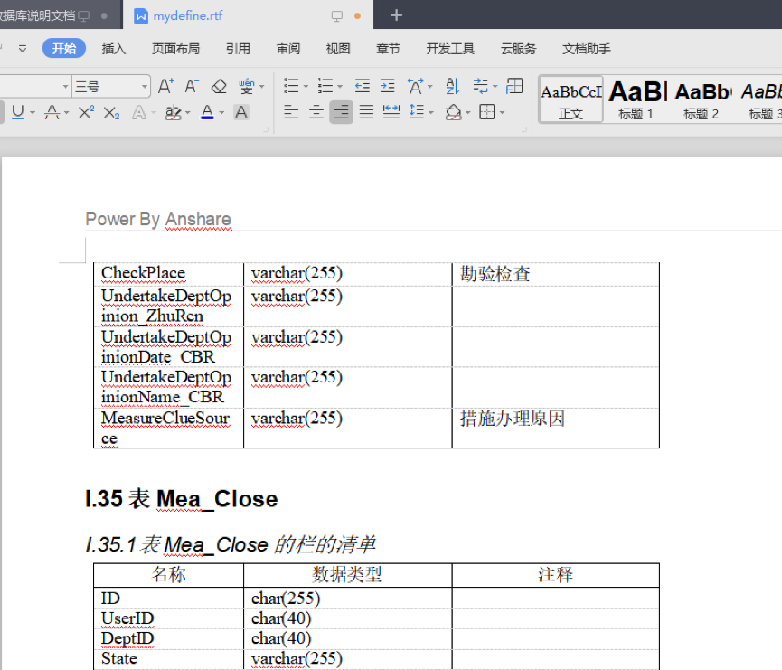

# 使用powerdesign制作数据库说明文档

## 安装powerdesign

- 地区选择hongkong

- 勾选需要的组件，建议全选

- 一直点下一步安装，完成后，复制破解补丁pdflm16.dll覆盖到软件安装目录%Sybase\PowerDesigner 16%下。

## 逆向生成pdm模型
- 先导出数据库脚本，这里使用的是mysql数据库，建议仅导出结构，数据量大的话生成模型会很慢。
- 逆向生成数据模型.
  

- 点击file菜单，选择reverse engineer—>database

     

- 选择正确的mysql版本，这里选择mysql5.0

- 勾选Using script files后点击addfiles按钮将前面导出的数据库脚本文件.sql添加进来，确定。

- 点确定后将自动反向生成数据库模型

## 生成说明文档

- 这里自定义一个最简单实用用于生成字段列表的模板，点击ReportTemplates。

- 点击新建模板		

- 选择PDM物理模型，设置模板名称及语言

- 新建的模板右侧只有根目录名，我们可以从左侧添加文档所需要显示的内容模块

> PS：这里选择了一个title，一个以个体表为单元模块的table，再往里添加了表的描述以及表的栏（字段）清单，diagram是生成uml数据库视图（暂时没用到），此处我直接是使用navicates生成的PNG格式模型图，查看更加方便更快速。

- 右击LIST OF TABLE COLUMNS可以编辑columns要显示的数据类型，并调节合适的列宽度。

- 制作模板后ctrl+s保存起来，我会把这个制作好的rep包含在文件内，可以直接使用。

## 生成数据库说明文书

- 切回模型窗口，点击report选择generate Report.

- 选择为rtf格式，rtf格式可以直接用word打开，可另存为doc格式。

- 提示已经成功生成模板，现在是否打开编辑，我们可以打开查看或编辑，或到刚刚选择保存的目录下找到该rtf文件。

> **大功告成**
